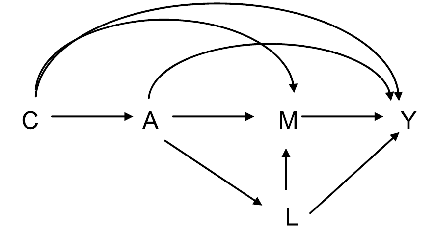
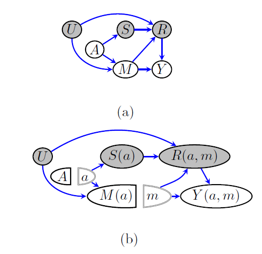
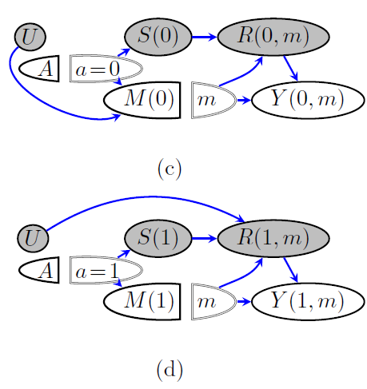
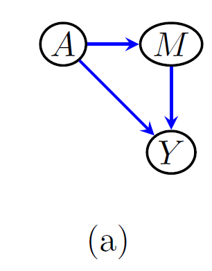
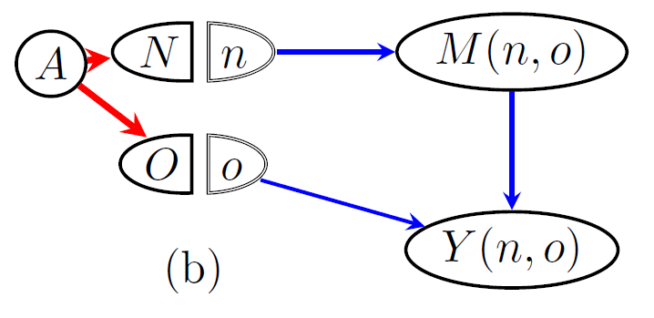

# Mediation Analysis

BST 258

---

## Conceptual Issues in Mediation Analysis
### VanderWeele and Vansteelandt (2009)

---

---

## Conceptual Issues

**1. Cross-world Independence:** Can be problematic **if the mediator is measured much later than the time that exposure takes place.** This is because of the exposure-induced confounder. 
- Consider the exposure-induced confounder, $L$. 
- Consider the NPSEM $\mathbf{L = f_L(A, U_L)}$, $M = f_M(A, L, U_M)$, $Y = f_Y(A, M, L, U_Y)$.
$$\mathbf{L(a^*) = f_L(a^*, U_L)}, M(a^*) = f_M(a^*, L(a^*), U_M) = f_M(a^*, \mathbf{f_L(a^*, U_L)}, U_M)$$

---

$$
\left.
\begin{aligned}
L(a^*) &= f_L(a^*, U_L) \\
M(a^*) &= f_M(a^*, L(a^*), U_M)
       = f_M(a^*, f_L(a^*, U_L), U_M)
\end{aligned}
\right\}
\quad \text{share } U_L
$$

$$
\left.
\begin{aligned}
L(a) &= f_L(a, U_L) \\
Y(a,m) &= f_Y(a,m,L(a),U_Y)
       = f_Y(a,m,f_L(a,U_L),U_Y)
\end{aligned}
\right\}
\quad \text{share } U_L
$$

### Therefore, we see that cross-world independence is violated due to $U_L$:

$$Y(a,m) \not\!\perp\!\!\!\perp M(a^*)$$

---
## Conceptual Issues

### Conditioning on the exposure-induced confounder?

---

## Conceptual Issues

**2. Infeasible intervention on the mediator:** In our framework, we consider the mediator to be the intervention node as well. **But sometimes, mediators of interest cannot be intervened.**

VanderWeele cites a psychology study by Nelson et al. (1997) where the **mediator was general political attitudes towards the right to free speech and the maintenance of public order.** We cannot intervene on political attitudes directly. 

---

## Conceptual Issues

**3. Composition assumption:** In many cases,  **it is difficult to think of interventions that non-invasively fix the mediator.**
- **Natural setting:** Setting $A=a$ and then "letting $M$ naturally become $M(a)$" via only an intervention on the exposure node
-  **"Forced" natural setting:** is a very different physical action than setting $A=a$ and forcing $M$ to become $M(a)$ via some external mechanism. 

---

## Defending the Composition Assumption

- The **consistency assumption $Y=Y(a, m)$ given $A=a, M=m$ already entails the assumption of noninvasive intervention on the mediator.**

- Thus, if a researcher accepts composition, no philosophical reason to not accept the composition.

---

## River Blindness Study 
### (Robins et al. 2022)

- $A$ is the indicator of being randomized into the study
- $M$ is the indciator of being treated with Ivermectin, the river blindness medicine.
- Ivermectin is assumed to be commercially available, so $A=0$ group can still self-treat Ivermectin in their own discretion.
- $U$ is an unmeasured confounder, $S$ and $R$ lost due to fire.

---
## River Blindness Study 
-  Due to Ivermectin side-effects, an immunosuppressive therapy may be required at a nearby clinic established by the investigators.

- $S$ is the indicator of access to the clinic, and $R$ the indicator of immunosuppressive therapy. 

---
## River Blindness Study 

- The patients not selected into $A=1$ do not have access to immmunosuppression nor the clinic, thus $S=0$, $R=0$ for them. 

- $S=1$ iff $A=1$. 
- **No arrow from $U$ to $R(0, m)$ since $R(0, m) \equiv 0$.**
- **No arrow from $U$ to $M(1)$ since $a=1$ means randomized.**

---

## River Blindness Study 

### Are we allowed to ignore the inaccessible variables and simpify the diagram to the left version? No.
 

---

## Cross-world confounding pathway
$$M(a=0) \leftarrow U \rightarrow R(s=1, m) \rightarrow Y(s=1, m)$$

$$\text{Therefore, } M(a=0) \not\perp Y(s=1, m).$$
Recall that $A$ determines $S$ completely. In particular, $A=S$ and $S(a=1) = 1$ always holds. 

$$\therefore Y(s=1, m) = Y(a=1, m)$$

$$\textbf{Therefore, } \mathbf{Y(a=1, m) \not\perp M(a=0)}$$

---
## Interventionist Framework (By Robins, motivated by Pearl)
### Robins, Richardson, Shpitser (2022)

---
## Pearl's Setup and an Argument on why PDE may be of interest

- $A$: smoking status (binary)
- $M$: hypertension status (binary)
- $Y$: outcome of myocardial infarction (MI) (binary)

**Setup: Nicotine is the only component of cigarette that affects $M$**

**Question of interest: Causal effect of providing nicotine-free cigarettes to smokers**
 
**Why?: They will have the hypertension level same as to that of the non-smokers, $M(a=0)$.** Thus, the following is an interesting quantity:
$$
PDE = E[Y(a=1, M(a=0))] - E[Y(a=0, M(a=0))]
$$

---
## Reformulation of the problem 

$M$ is only affected by $N$, not $O$. 

$$
\mathbf{PDE = E[Y(n=0, o=1)] - E[Y(n=0, o=0)]}
$$

Consider 3 cases of the data:
1. The original observed data where **$\mathbf{A}$ was randomized**, $(A, M, Y)$. 
2. A "Desirable" data from **four-arm randomization of $\mathbf{(N, O)}$**, with counterfactuals $(M(n, o), Y(n, o))$ observed for $(n, o) \in \{0, 1\}^2$. 
3. **A censored version of the four-arm data**, where only $n=o$ cases are given to us.

---
## Reformulation of the problem

We should see that data 1 allows us to identify the distribution of the data 3 by:
$$\begin{aligned}
p(M=m, Y=y | A=a) \\
&= p(M(n=a, o=a)=m, Y(n=a, o=a)=y | A=a) \\
&= p(M(n=a, o=a)=m, Y(n=a, o=a)=y)
\end{aligned}$$

The first line holds due to determinism $A=N=O$, and the second line holds from $\{M(n, o), Y(n, o)\} \perp A$ from the SWIG.

---
## Identification using the reformulated setup

Proposition 1 in  Robins et al. (2022):
**Under our SWIG, the 4-arm study's counterfactual outcomes are identifiable. Using the data of the $A$-randomized study.**

